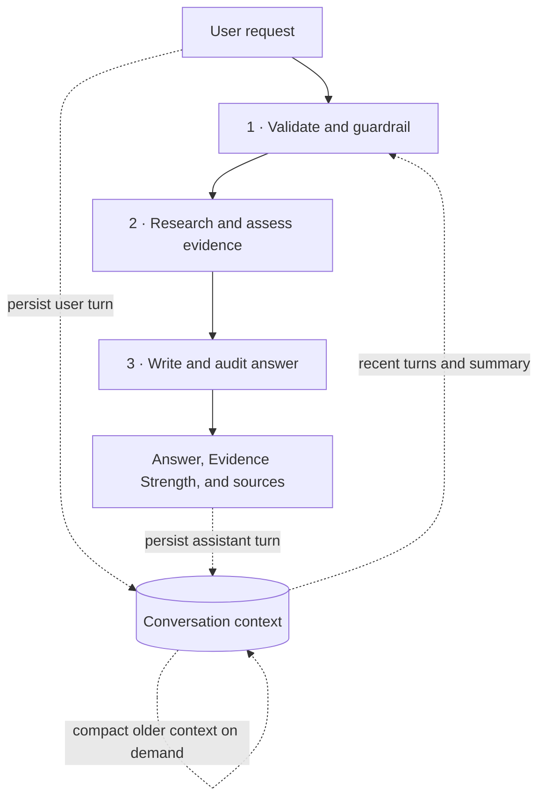
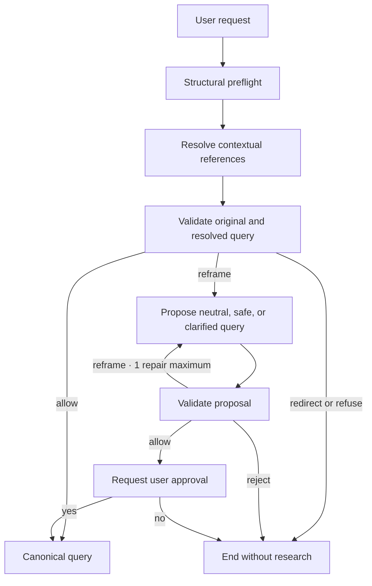
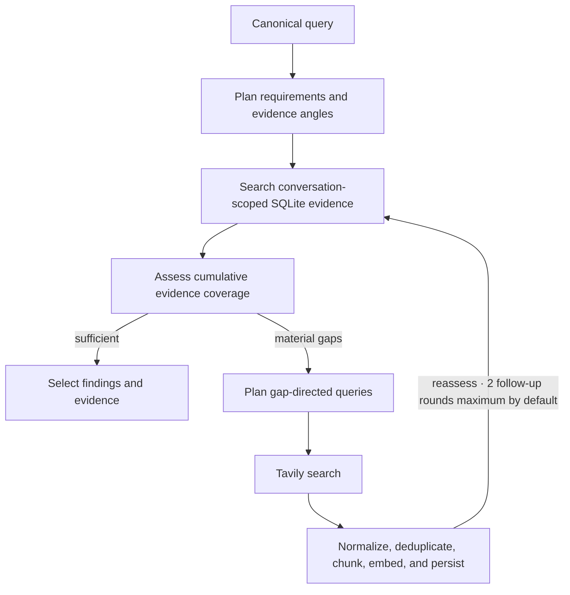
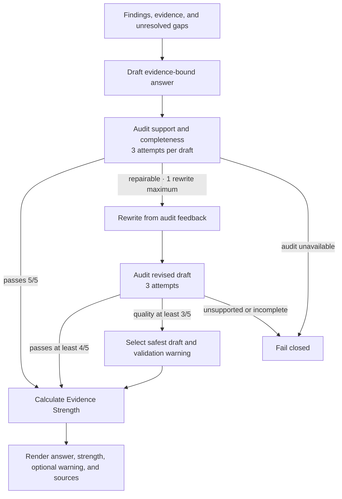

# Architecture

Civic Assess is a three-stage reasoning pipeline with cross-cutting conversation
context. LangGraph owns top-level transitions; local code owns persistence, bounds,
and rendering.

## System overview

## 1 · Validation and guardrails

## 2 · Research and evidence assessment

## 3 · Answer synthesis and audit

## Package boundaries

- `app/application`: conversation lifecycle and interface use cases
- `app/orchestration`: graph transitions and bounded coordinators
- `app/features`: reasoning, conversation, research, and answer capabilities
- `app/domain`: infrastructure-independent contracts
- `app/infrastructure`: model providers, Tavily, SQLite, and repositories
- `app/prompts`: versioned role contracts
- `app/observability`: progress, usage, and structured logs
- `evals` and `tests`: live behavior measurement and regression coverage

## Models

TOML assigns ordered OpenAI, Groq, or Anthropic candidates to each agent role.
Evidence retrieval uses revision-pinned `BAAI/bge-small-en-v1.5`, loaded lazily and
once per process for token-aware chunking and normalized embeddings.

## Persistence

SQLite stores turns, compacted conversation state, documents, chunks, and
embeddings. WAL, write reservations, constraints, and ingestion fingerprints
provide predictable, idempotent writes for a single application instance.

## Retrieval

Conversation-scoped evidence is searched before Tavily. FTS5/BM25 lexical ranks
and embedding cosine ranks are combined with weighted reciprocal-rank fusion;
coverage-aware selection limits duplicate documents across planned requirements.

## Async and locking

- A per-conversation `asyncio.Lock` serializes the full interaction.
- SQLite `BEGIN IMMEDIATE` reserves writes; WAL permits concurrent reads.

SQLite and embedding work runs in worker threads. Independent retrieval, provider,
and search calls use async concurrency.
